<p align="center">
  
</p>

<h1 align="center">Jellio</h1>

<p align="center">
  A custom web client plugin for Jellyfin, styled after modern streaming apps<br>
  and built around remote/debrid sources resolved through Gelato.
</p>

## Features

- Custom home screen — Continue Watching, Up Next, recommendation rows,
  per-library catalog rows, genre rows, a hero carousel, and a
  customizable row layout
- Full search, library browsing, person pages, and detail screens for
  movies, series, and episodes
- Calendar view for upcoming releases
- Watchlists and custom list membership
- Custom player — subtitle and audio track selection, trickplay
  scrubbing, Intro Skipper integration, a sleep timer, and an Up Next
  overlay with countdown auto-advance
- Real-duration correction for playback: since Gelato-resolved sources
  often don't match their library metadata runtime (broadcast-slot
  runtimes from TMDB/TVDB vs. the real file), Jellio learns each title's
  actual duration from playback itself and uses it for watched-state
  crediting, Continue Watching, and Jellyfin's own played/unplayed state
- Group Watch — create or join watch parties over Jellyfin's native
  SyncPlay, with invites, in-player chat, join sync, and a
  ranking/voting flow for picking what to watch next
- Profiles with avatars and banners, an achievement/badge system with a
  real activity feed and binge streaks, and per-user privacy controls
- Notifications, including admin broadcast messages
- Seasonal home screen theming
- Its own login/account switcher on top of Jellyfin's real authentication

## Installation

Jellio is distributed as a Jellyfin plugin repository.

1. In Jellyfin, go to **Dashboard → Plugins → Repositories**
2. Add a repository with this URL:
   ```
   https://noahskipp.github.io/Jellio/repository.json
   ```
3. Go to **Catalog**, find **Jellio** under Jellio's repository, and
   install it
4. Restart Jellyfin

Updates are then picked up the same way as any other plugin — a new
version appears under **Catalog** once published, and updating in place
keeps your configuration, achievements, and other plugin data intact.

## Requirements

- Jellyfin server `10.11.11`
- A library backed by [Gelato](https://github.com/lostb1t/Gelato) (or a
  similarly remote-resolved source) — Jellio assumes no local media

## Credits

- UI/UX inspired by [Nuvio](https://github.com/NuvioMedia/NuvioTV) and
  [Harbor](https://github.com/harborstremio/harbor)
- Seasonal theming based on
  [CodeDevMLH/Jellyfin-Seasonals](https://github.com/CodeDevMLH/Jellyfin-Seasonals)
- Sleep timer based on
  [jon4hz/jellyfin-plugin-jellysleep](https://github.com/jon4hz/jellyfin-plugin-jellysleep)
- In-player episode preview based on
  [Namo2/InPlayerEpisodePreview](https://github.com/Namo2/InPlayerEpisodePreview)
- Achievement badges based on
  [ZL154/AchievementBadges_for_Jellyfin](https://github.com/ZL154/AchievementBadges_for_Jellyfin)

## Disclaimer

This is a personal project built for my own Jellyfin server, developed
with AI-assisted coding and manual review. Use at your own discretion.

## License

[GPL-3.0](LICENSE)
